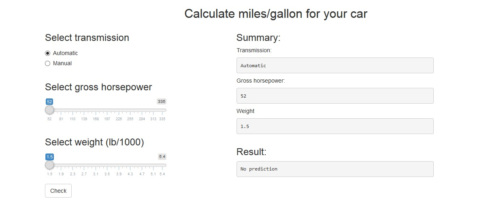

---
title       : Miles per gallon calculator
subtitle    : Developing Data Products Project
author      : £ukasz Grzybowski
job         : 
framework   : io2012        # {io2012, html5slides, shower, dzslides, ...}
highlighter : highlight.js  # {highlight.js, prettify, highlight}
hitheme     : tomorrow      # 
widgets     : []            # {mathjax, quiz, bootstrap}
mode        : selfcontained # {standalone, draft}
knit        : slidify::knit2slides
--- 

## Introduction

Application used to calculate how far car can drive expressed by Miles per gallon (US) based on transmission  type, gross horsepower and weight (lb/1000).  


Mtcars dataset consist of data extracted from the 1974 Motor Trend US magazine has been used to prepare prediction model (for more details please read documentation `?mtcar`.

<center></center>
<center><pre>application screen</pre></center>


--- .class #id 

## Input data

You have to choose options from 3 areas:

- transmission as automatic or manual by radio buttons
```{r,eval=FALSE}
radioButtons("am", label = h3("Select transmission"),
choices = list("Automatic" = "Automatic", "Manual" = "Manual"), selected = "Automatic")
```
- gross horsepower between 52 and 335 by slider input
```{r,eval=FALSE}
sliderInput("hp", label = h3("Select gross horsepower"),
min = 52, max = 335, value = 10)
```
- weight (lb/1000) between 1.5 and 5.4 by slider input
```{r,eval=FALSE}
sliderInput("wt", label = h3("Select weight (lb/1000)"),
min = 1.5, max = 5.4, value = 0.1)
```

--- .class #id 

## Output data

We have 2 types of output:

- summary of selected options which are refreshed with reactive way
```{r,eval=FALSE}
h3("Summary:"),
h5("Transmission:"),
verbatimTextOutput('am'),
h5("Gross horsepower:"),
verbatimTextOutput('hp'),
h5("Weight"),
verbatimTextOutput('wt')
```
- result appear after click button 'Check', before there is statement 'No prediciton'
```{r,eval=FALSE}
h3("Result:"),
verbatimTextOutput('result')
```

--- .class #id 

## Alghorithm
Prediction model based on linear regression with interaction on limited dataset. This dataset has only 4 variables:
- mpg (Miles/(US) gallon) - predicted value,
- hp (Gross horsepower)
- wt (Weight lb/1000)
- am (Transmission 0 = automatic, 1 = manual)
```{r,eval=FALSE}
lm(mpg~factor(am)+hp+wt+wt*factor(am),data=mycars)
```

Prediction  is calculated after action button click. For this behavior based on `isolation({})` function.